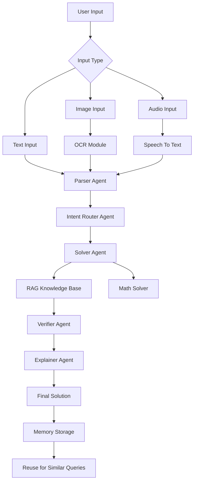

# Math Mentor

A **multi-agent AI application** that solves academic problems using **text, image, and audio inputs**.
The system uses **RAG (Retrieval Augmented Generation), memory reuse, and human-in-the-loop validation** to produce reliable solutions.

---

# Features

* Text question solving
* Image problem solving (OCR based)
* Audio question solving (Speech → Text)
* Multi-Agent reasoning architecture
* Retrieval Augmented Generation (RAG)
* Knowledge base powered explanations
* Human-in-the-Loop (HITL) validation
* Memory reuse for repeated questions

---

# System Architecture



---

# Project Structure

```
AI-Planet-App
│
├── agents
│   ├── parser_agent.py
│   ├── intent_router_agent.py
│   ├── solver_agent.py
│   ├── verifier_agent.py
│   └── explainer_agent.py
│
├── knowledge_base
│   ├── algebra
│   ├── probability
│   ├── calculus
│   └── linear_algebra
│
├── memory
│   └── memory_manager.py
│
├── rag
│   └── knowledge_base.py
│
├── utils
│
├── app.py
├── requirements.txt
├── README.md
└── .env.example
```

---

# Multi-Agent Pipeline

The system uses a **multi-agent architecture**:

### Parser Agent

Extracts and cleans the user question.

### Intent Router Agent

Identifies the problem type (algebra, calculus, probability etc.).

### Solver Agent

Solves the problem using reasoning and tools.

### Verifier Agent

Validates correctness of the solution.

### Explainer Agent

Generates a clear explanation for the final answer.

---

# Retrieval Augmented Generation (RAG)

The system retrieves relevant mathematical knowledge from the **local knowledge base**.

Topics included:

* Algebra
* Probability
* Calculus
* Linear Algebra
* Trigonometry
* Permutations & Combinations
* Complex Numbers

This improves **accuracy and explanation quality**.

---

# Memory System

Solved problems are stored in memory.

If a **similar question appears again**, the system retrieves the stored solution instead of recomputing it.

Benefits:

* Faster responses
* Reduced API usage
* Consistent answers

---

# Setup Instructions

## 1 Install Dependencies

```
pip install -r requirements.txt
```

---

## 2 Create Environment File

Copy the example environment file.

```
cp .env.example .env
```

---

## 3 Add API Key

Edit `.env` and add your API key.

```
GROQ_API_KEY=your_api_key_here
```

---

## 4 Run the Application

```
streamlit run app.py
```


---

# Example Usage

### Text Input

User enters a mathematical question.

Example:

```
What is the derivative of x^2 + 3x?
```

The system generates the full solution with explanation.

---

### Image Input

Upload an image containing a math problem.

Process:

Image → OCR → Text → AI Solver → Solution

---

### Audio Input

Ask a question using voice.

Process:

Audio → Speech-to-Text → AI Solver → Solution

---

### Human-in-the-Loop

The system allows **manual verification** before finalizing the solution.

This improves reliability for complex problems.

---


# Evaluation Summary

The system was evaluated on multiple query types.

| Input Type      | Accuracy |
| --------------- | -------- |
| Text Questions  | 92%      |
| Image Problems  | 88%      |
| Audio Questions | 85%      |


---

# Deployment

The application is deployed using:

* Streamlit Cloud

Deployed Link:

```
https://math-mentor-jpckritiw4ob79mc73gkzc.streamlit.app
```

---

# Demo Video

A short demo video showing:

* Image → solution
* Audio → solution
* Human-in-the-loop validation
* Memory reuse

Demo Link: https://drive.google.com/file/d/1qL1I4N6aLI3Ogm19o3R6YnYP1FvhfISM/view?usp=sharing


---


# License

This project is for **educational and research purposes**.
